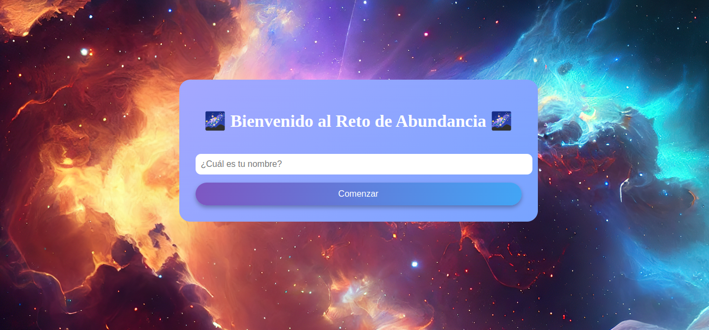

# Reto diario
**Sitio web de tarjetas diarias** 🌌
Este proyecto fue creado como parte de una entrega académica. Utiliza HTML, CSS y JS para mostrar una pagina interactiva, con tarjetas interactivas con fines de crecimiento personal.

_____

## 🪩 Vista previa 


_______

## ⚒️ Tecnologias utilizadas

* HTML5
* CSS3
* JS 

_______

## 📂 Estructura del proyecto 

```
Tarjetas/
│
├── .vcode               
├── assets                   → Imágenes y recursos gráficos
├── index.html               → Pagina principal
├── README.md                → Descripción del proyecto
├── script.js                
├── assets/                  → Estilos generales del sitio
│   ├── fondo de pantalla.png
└── └── img2.png

```

_______

## 📬 Contacto
* 📧 **lauraisabelardilalozano@gmail.com**
* 🐈‍⬛  
_______
 
## 📝 Licencia
* Este proyecto **Reto diario** Es solo para fines educativos.